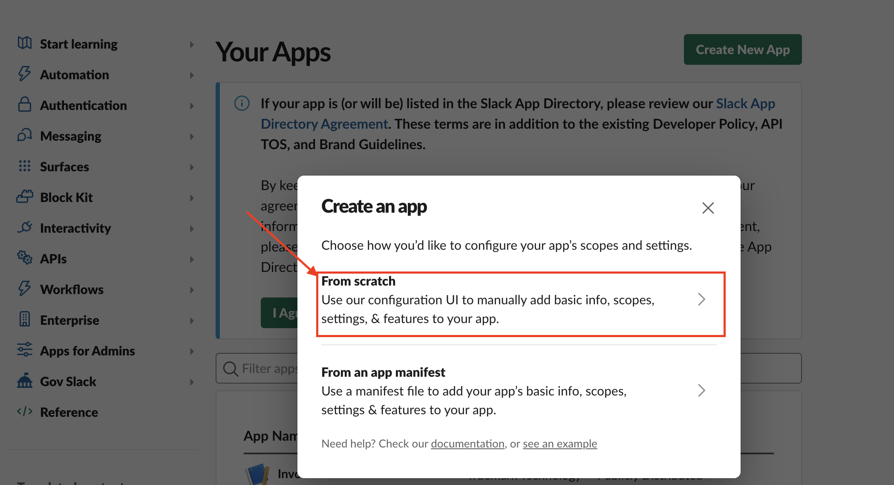
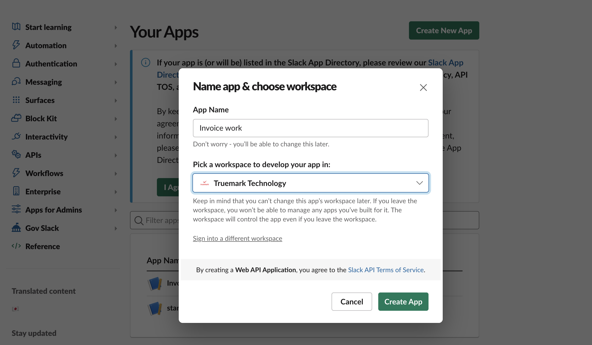
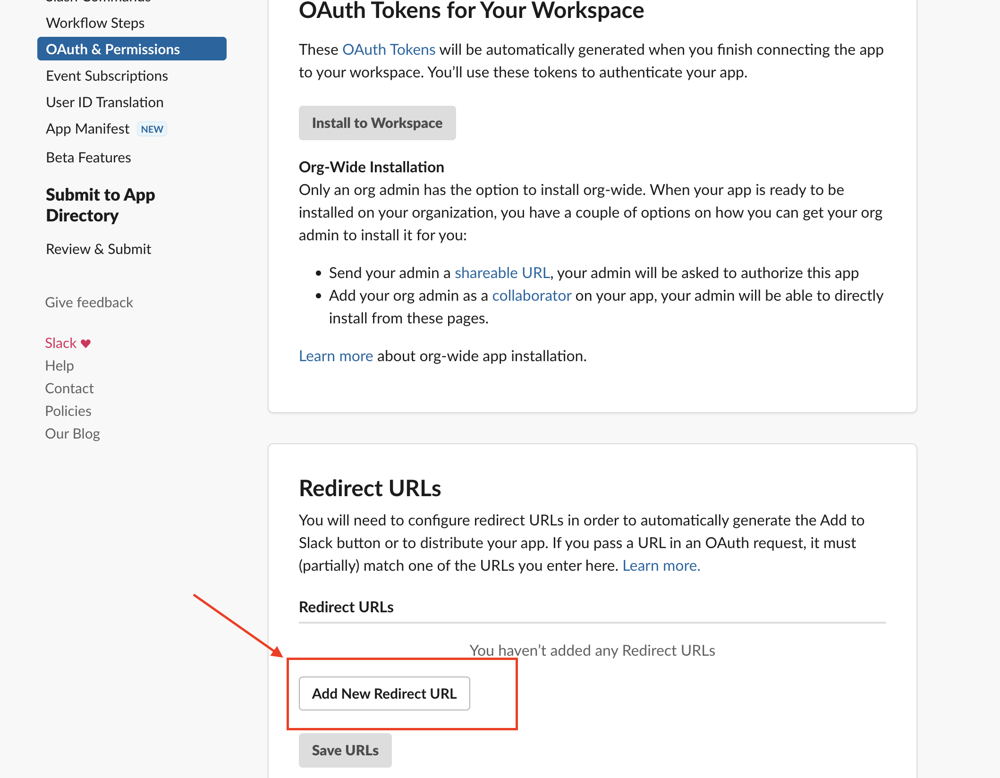
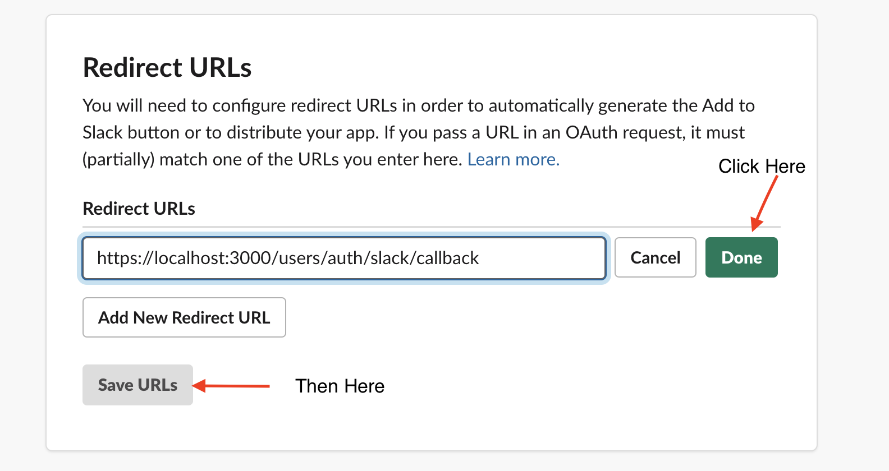
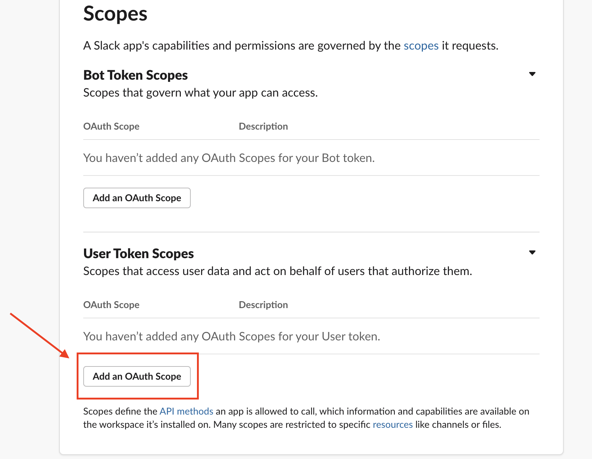
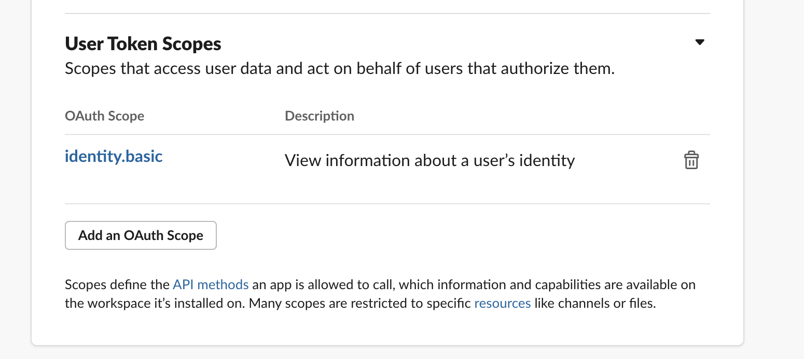
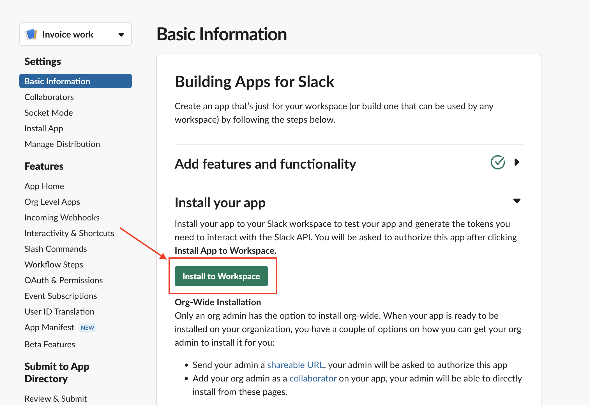
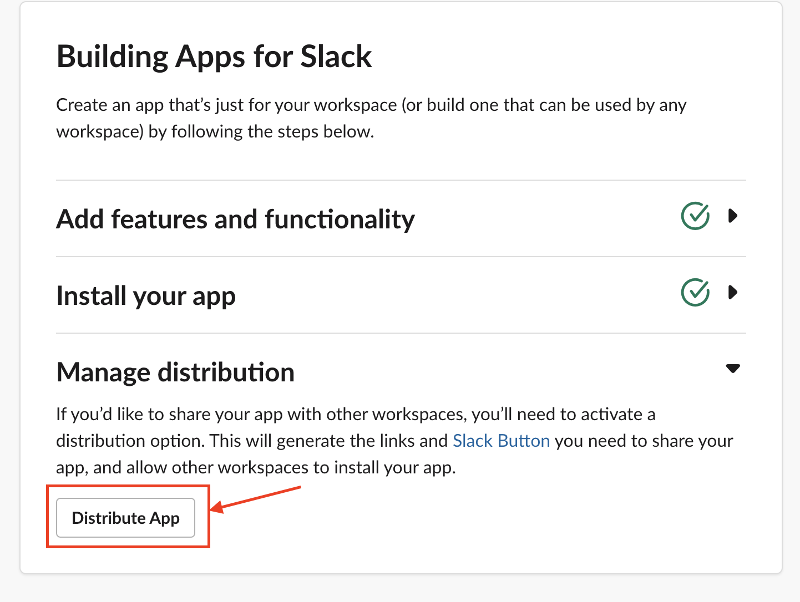
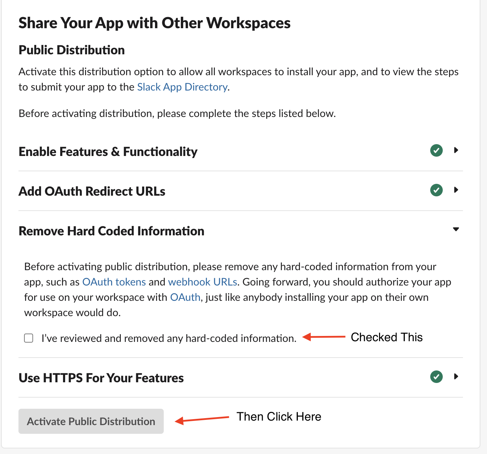
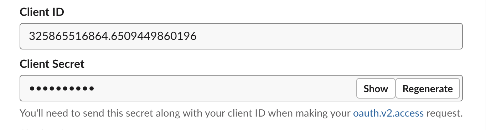

## Steps to setup Slack app
1. Go to slack apps page [Slack Apps](https://api.slack.com/apps)
2. On the Your Apps page, select Create New App.

    
3. Select From scratch.

    
4. Enter your App Name. For this example, enter "invoice work".
5. Select the Workspace where you'll be developing your app.

    
6. Within OAuth & Permissions, scroll down to Redirect URLs.

7. Click Add New Redirect URL and add callback url, in our case for local development add `https://localhost:3000/users/auth/slack/callback`

    

    
8. Within OAuth & Permissions, scroll down to Scopes. There you can add appropriate user or bot scopes depending on your needs.
9. Under User Token Scopes, click Add an OAuth Scope.

    
10. To get basic information of users give identity.basic scope

    
11. Return to the Basic Information section of the app management page.
12. Install your app by selecting the Install to Workspace button.

    
13. From within the basic information, under Manage distribution click on Distribute App and click on Activate Public Distribution for sharing this app with other workspace.

    

    
14. From within the basic information, copy Client ID and Client Secrete and paste it on the public_key and private_key of slack respectively. 

    

